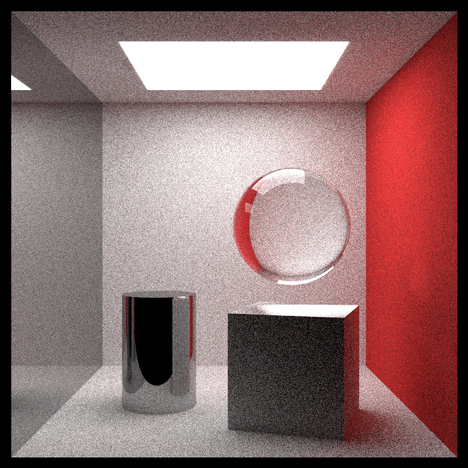

# Usage 

## Examples of scenes

If you want to test how the program works, you can test one of four scenes I made to show you a template of what the program is capable of.

```rust
    fn main() {
    // Set of materials and their refraction index
    let materials: Vec<&str> = vec!["air", "water", "glass", "diamond"];
    let indexes: Vec<f64> = vec![1.003, 1.33, 1.52, 2.42];

    let mut refraction_indexes: HashMap<&str, f64> = HashMap::new();
    materials
        .iter()
        .zip(indexes)
        .for_each(|(&material, index)| {
            refraction_indexes.insert(material, index);
        });

    //World settings, adding objects

    let mut world: HittableList = HittableList::new();

    // Differents scenes 
    // (Uncomment one of these lines to render different scenes templates)

    // let mut camera: Camera =  spheres(&mut world, refraction_indexes);
    // let mut camera: Camera = cornell_box(&mut world, refraction_indexes);
    let mut camera: Camera = light(&mut world, refraction_indexes);
    // let mut camera: Camera = testing(&mut world, refraction_indexes);

    camera.render(&mut world);
}
```

then you just type ```cargo build --release``` and then ```./target/release/rt```
to build an optimised version of the binary and execute it to begin the image rendering.

## Code explanation and how to use it
### <u>Materials part :</u>

In this program, there is several Materials available:
-   Lambertian (The basic of basics materials, this is a plain, opaque, monochrome) you instance it like that : 
```rust
    let blue_material: Rc<Lambertian> = Rc::new(
            Lambertian::new(
                Color::new(0.0, 0.0, 1.0)
            )
        )
```
The ```Color``` object is a 3D Vector with values between 0.0 to 1.0 (it's converted after in rgb conventionnal u8 values).


-   Metal (It reflects all the light rays that are pointed to itself) you instance it like that :
```rust
    let metal_material: Rc<Metal> = Rc::new(
            Metal::New(
                Color::new(0.5, 0.7, 0.9),
                0.0
            )
        )
```
Like the *Lambertian* material, the metal has a Color (between 0.0 to 1.0) and a new parameter called fuzziness (or fuzz if you want). The fuzziness is the reflectance coefficient, at 0.0 it reflects all the light (it's a mirror-like material) and at 1.0 you barely see the reflection of the environment around it.    

-   Dielectric (The name seems overcomplicated but it's just a material with a refraction index [See Snell's Law](https://en.wikipedia.org/wiki/Snell's_law))
You instance it like that :
```rust
    let glass_material: Rc<Dielectric> = Rc::new(
            Dielectric::new(
                refraction_indexes["glass"]
            )
        )
```
As you can see, there is the ```refraction_indexes["glass"]``` parameter. It's just a floating point stored in a ```HashMap<String, f64>``` to simplify even more the comprehension of the code. 


> [!TIP]
>  Here is a List of all refraction indexes already available for you :
> - Air (yes actually all of surroundings of objects rendered is considered as a void (litterally like space void)) 
> - Water
> - Glass 
> - Diamond.

<u>***Here is an example with all the materials evoked above :***</u>


<br>

> [!WARNING] 
> I showed you only the materials, if you put only that in your main you'll have nothing displayed because we didn't instanced **objects** but only their materials.

<br>

-   DiffuseLight (a material wich behave like another independant light source in our scene)
You instance it like that :
```rust
    let light: Rc<DiffuseLight> = Rc::new(
            DiffuseLight::new(
                Color::new(14.0, 14.0, 14.0)
            )
        )
```
As you can see the ```DiffuseLight```material is the only one with color value larger than 1.0, it's because you can go beyond this limit to set the emissive power of the light source (5.0 is a weaker lightning than 10.0)


### <u>Objects part :</u>

Now that we saw how to instance materials, we need to 'bind' them to an object in order to tell our program how the object will be represented and diplayed.

#### The Sphere :

```rust
    // Sphere::new(center: 3D vector, radius : floating point, material)
    let blue_sphere: Rc<Sphere> = Rc::new(
        Sphere::new(
            Point::new(0.0, 0.0, 0.0),
            5.0,
            glass_material
            )
        )
```

As you can see i mentionned that the first parameter is a 3D Vector but i marked ```Point::new()``` in the code sample, it's just more understandable when you read it.
(it's at the import location that i write it like ```use glam::DVec3 as Point, etc...```)

#### The Plane surface (Quad) :

```rust
    // Quad::new(starting_point: 3D Vector, u and v the directionnal 3D Vectors in mathematical algebra to calculate the plane surface, material)
    
    let light_plane_surface: Rc<Quad> = Rc::new(
        Quad::new(
            Point::new(0.0, 0.0, 0.0),
            DVec3::new(3.0, 1.0, 0.0),
            DVec3::new(6.0, 1.0, 0.0),
            light_material,
        )
    )
```

#### The Cube (formed with 6 quads) :

```rust
    // Quad::new(starting_point: 3D Vector, u and v the directionnal 3D Vectors in mathematical algebra to calculate the plane surfaces, material)
    
    let diamond_box: Rc<dyn Hittable> = Rc::new(
        box_shape(
            Point::new(0.0, 0.0, 0.0), 
            DVec3::new(3.0, 1.0, 0.0), 
            DVec3::new(6.0, 1.0, 0.0), 
            diamond_material
        )
    )
```

#### The Cylinder : 

```rust
    // Quad::new(starting_point: 3D Vector, u the directionnal 3D Vector where the top of cylinder points to, radius: f64, height: f64, material)

    let cylinder: Rc<Cylinder> = Rc::new(Cylinder::new(
        Point::new(400.0, 0.0, 250.0),
        DVec3::new(0.0, 1.0, 0.0),
        60.0,
        180.0,
        metal,
    ));
```

### <u>**Moving instances :**</u>
There is two moving instance to rotate boxes and translate them, It can be useful when you want to see a left side of a box AND a right side of another box.

Here is the signature of each instanciation of thes two moving 'objects'.
```rust
Rotate :
    pub fn new(object: Rc<dyn Hittable>, angle: f64) -> Self
Translate :
    pub fn new(object: Rc<dyn Hittable>, offset: DVec3) -> Self
```

It returns a new instance of your old object, but rotated (or translated) with an angle or offset (for translate) given as a parameter.
We'll see its purpose below when we'll create a scene. 

## <u>**The Setup of a whole Scene :**</u>

Here we are ! Now with all those informations about how to setup an object in our world, let's make it display on our Scene !
A scene will be a function returning our ```Camera``` object with some settings applied to it in the scene.

-   The signature of the function / Scene
```rust 
pub fn cornell_box(world: &mut HittableList, refraction_indexes: HashMap<&str, f64>) -> Camera
```
World refers to a HittableList which will contains all of our objects. You can see how it's used in the [main file](./src/main.rs).

- Instanciation of materials 
```rust
    let red: Rc<Lambertian> = Rc::new(Lambertian::new(Color::new(0.65, 0.05, 0.05)));
    let white: Rc<Lambertian> = Rc::new(Lambertian::new(Color::new(0.73, 0.73, 0.73)));
    let green: Rc<Lambertian> = Rc::new(Lambertian::new(Color::new(0.12, 0.45, 0.15)));
    let light: Rc<DiffuseLight> = Rc::new(DiffuseLight::new(Color::new(15.0, 15.0, 15.0)));
    let metal: Rc<Metal> = Rc::new(Metal::new(Color::new(0.5, 0.5, 0.5), 0.0));
```

-   Adding all the objects to our world
```rust
    // Adding walls
    world.add(Rc::new(Quad::new(
        Point::new(555.0, 0.0, 0.0),
        DVec3::new(0.0, 555.0, 0.0),
        DVec3::new(0.0, 0.0, 555.0),
        metal.clone(),
    )));
    world.add(Rc::new(Quad::new(
        Point::new(0.00, 0.0, 0.0),
        DVec3::new(0.0, 555.0, 0.0),
        DVec3::new(0.0, 0.0, 555.0),
        red,
    )));
    
    ...

    // Adding box and rotate it 
    let mut right_box: Rc<dyn Hittable> = box_shape(
        Point::new(0.0, 0.0, 0.0),
        Point::new(165.0, 165.0, 165.0),
        white.clone(),
    );
    right_box = Rc::new(Rotate::new(box, -18.0));
    right_box = Rc::new(Translate::new(box, DVec3::new(130.0, 0.0, 65.0)));


    world.add(right_box);
    ... 
```

> [!NOTE]
> You can see above how to use the ```Rotate``` and ```Translate``` instances.


-   Camera settings :
```rust
    let image_width: i32 = 800;
    let aspect_ratio: f64 = 1.0;
    let camera_fov: f64 = 40.0;
    let camera_background: Color = Color::new(0.0, 0.0, 0.0);

    // camera position
    let look_from: Point = Point::new(278.0, 278.0, -800.0);
    let look_at: Point = Point::new(278.0, 278.0, 0.0);
    let vup: DVec3 = DVec3::new(0.0, 1.0, 0.0);

    // depth of field
    let defocus_angle: f64 = 0.0;
    let focus_dist: f64 = 10.0;

    let samples_per_pixel: f64 = 100.0;
    let max_depth: f64 = 50.0;
    let brightness: f64 = 1.0;
```

<u>***Here is a breakdown of all the camera settings and what's their purpose for the display :***</u>

> **camera_fov** -> the field of view (more is distorted, less is more 'zoomy')

> **camera_background** -> the ambiant lightning of the scene (if set to 0 it's pitch black darkness)

> **look_from, look_at and vup** -> settings to set the position of the ```Camera``` (the naming is already pretty verbose)

> **defocus_angle** -> the disk where the image will be blurry (we set a blurry field tighter or wider from the ```look_at``` center point), it works like a vignette in photography

> **focus_dist (default value is 10)** -> the distance where your focus will be sharp (if defocus angle is set to 0 it does nothing)

> **sample_per_pixels** -> the smoothness of the anti-aliasing, more sample per pixels means a smoother antialiasing.

> [!CAUTION]
> More sample_per_pixels equals to a longer runtime to render the image !! use it carefully. 

> **max_depth** -> the limit of bounce a ray can do, 50.à means a ray for one pixel will bounce 50 times in the world then render the correct color (a greater value means also a greater rendering time !)

> **brightness** -> the default value is 1.0, lower means darker, higher means brighter. As simple as it is.

-   And then we return the camera with all the settings set.
```rust
    let camera: Camera = Camera::new(
        camera_fov,
        image_width,
        look_from,
        look_at,
        vup,
        aspect_ratio,
        samples_per_pixel,
        max_depth,
        defocus_angle,
        focus_dist,
        camera_background,
        brightness,
    );

    return camera
```

## Finally we render it all in the main :

```rust
    let mut world: HittableList = HittableList::new();
    let mut camera: Camera = cornell_box(&mut world, refraction_indexes);

// Launching the rendering, sweet dreams !
    camera.render(&mut world);
```

## And the result :



&copy; All rights of the program belongs to [@RhapsodyGMZZ](https://github.com/RhapsodyGMZZ)